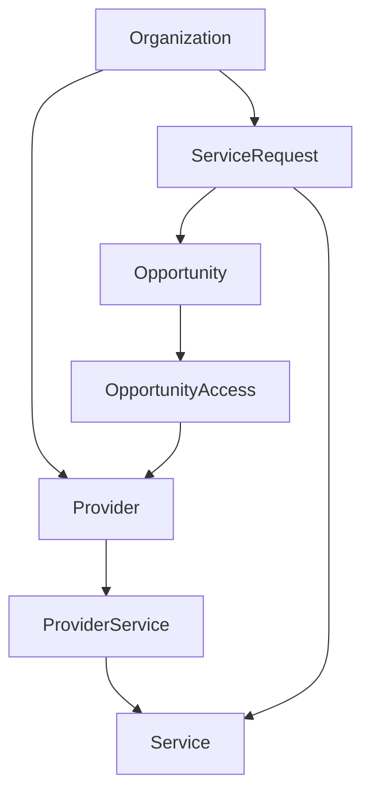

# Smart360 Development Skill

Use this skill when implementing, modifying, testing, reviewing, or designing any Smart360 v3 feature.

## Required Reading & Alignment

Before editing any code, you must:
1. Read the following reference files:
   - [AGENTS.md](file:///home/marcelo/projetos/smart360-v3/AGENTS.md) (relative path: `../../../AGENTS.md`)
   - [SMART360_ARCHITECTURE.md](file:///home/marcelo/projetos/smart360-v3/docs/architecture/SMART360_ARCHITECTURE.md) (relative path: `../../../docs/architecture/SMART360_ARCHITECTURE.md`)
   - [DEVELOPMENT_WORKFLOW.md](file:///home/marcelo/projetos/smart360-v3/docs/architecture/DEVELOPMENT_WORKFLOW.md) (relative path: `../../../docs/architecture/DEVELOPMENT_WORKFLOW.md`)
2. If working on marketplace features, understand the current marketplace entities and application architecture before editing.
3. Follow Hexagonal Architecture (interfaces -> application -> domain).
4. Maintain domain purity (no Django, ORM, framework-specific or LLM SDK imports in domain).
5. Respect multi-tenancy (User -> Membership -> Organization).
6. Respect existing repository ports and use cases.
7. Prefer extending existing abstractions over duplicating them.
8. Avoid ORM leakage into application/domain layers.
9. Avoid premature abstractions.
10. Use incremental implementation.
11. Run relevant tests.
12. Report exact files changed.
13. Never commit/push/deploy without explicit user instruction.

---

## Marketplace Model

The conceptual model of the marketplace is structured as follows:

### Concept Clarifications:
- **Provider side**: Provider -> ProviderService -> Service
- **Demand side**: Organization -> ServiceRequest -> Service
- **Commercial side**: ServiceRequest -> Opportunity -> OpportunityAccess -> Provider

---

## Current Marketplace Principles

- **ServiceCategory**: Global taxonomy.
- **Service**: Global marketplace taxonomy. Not organization-owned.
- **Provider**: Commercial/operational marketplace profile. Not User. Not Organization. Linked to Organization.
- **ProviderService**: Explicit capability relation. No hidden ManyToMany.
- **ServiceRequest**: Request/demand owned by requesting Organization.
- **Opportunity**: Commercially distributable representation of ServiceRequest.
- **OpportunityAccess**: The fact that a Provider received commercial access to an Opportunity.

---

## Monetization Strategy

The Smart360 monetization strategy is hybrid and decoupled from the Matching engine:
- **Free provider entry**: Providers can enter without mandatory monthly subscriptions to maximize marketplace liquidity.
- **Optional subscription**: Paid recurring plans containing extra monthly credits, early alerts, and advanced tools.
- **Credits**: Purchased, promotionally granted, or subscription-included credits used to unlock opportunities.
- **Paid opportunity access**: Providers pay to unlock full customer contact details.
- **Configurable dynamic pricing**: Custo of unlocking opportunities may vary dynamically based on urgency, estimated ticket value, local supply, and competition.
- **Conditional auction**: Activated only under high competition, allowing providers to place a bid.
- **Privacy before unlock**: Sensitive customer contact info (name, email, phone) remains hidden until unlocked.
- **Configurable access limits**: Limit the number of providers who can unlock a single opportunity (initially default/configurable to 3).
- **Future revenue sources**: Open to commissions, sponsored listings, training/certification sales, and financial services.
- **AI-assisted pricing**: AI may estimate value or complexity but financial transactions must remain auditable and deterministic.
- **Economic telemetry**: Log economic events to measure LTV, CAC, ROI, and liquidity.

> [!IMPORTANT]
> **BID DOES NOT REPLACE QUALITY.**
> 1. Eligibility first (technical compatibility).
> 2. Matching quality second.
> 3. Commercial distribution / Monetization third.
> Ineligible providers must never become eligible merely by paying more.

---

## Current Development State

Completed conceptual sprints:
- **01A**: ServiceCategory
- **01B**: Service
- **01C**: Provider
- **01D**: ProviderService
- **01E**: ServiceRequest
- **01F**: Monetization Foundations
- **01G**: Candidate Discovery

Next planned direction:
- **01H**: Matching Score v1
- **01I**: Opportunity Distribution / Auction

---

## Testing Rules

- Test domain behavior (avoid Django initialization in domain tests where possible).
- Test application behavior using fakes/spies/doubles for ports where appropriate.
- Test infrastructure contracts and constraints.
- Preserve regression coverage.
- Use timezone-aware datetimes.
- Verify UUID invariants and inactive entity behaviors.
- Verify database constraints where relevant.
- When no schema changes are expected, `makemigrations --check` must return no changes detected. If an unexpected migration appears, STOP and explain.

---

## Performance

- Do not prematurely optimize.
- The known N+1 query pattern during Candidate Discovery (1 ProviderService query + N Provider lookups) is currently accepted for the MVP.
- Do not break hexagonal boundaries merely to optimize early. If necessary, introduce a dedicated read/query port.

---

## Migration Safety

- Never edit historical migrations unless explicitly instructed.
- Create new migrations for new schema changes.
- Always inspect the generated migrations before applying.

---

## Reporting

Upon completion of any implementation, provide a final report structured exactly as:
- **A. Implemented**: Objective summary.
- **B. Files changed**: Detailed list.
- **C. Architecture**: Explanation of how layers were preserved.
- **D. Database and migrations**: Summary of migration status.
- **E. Tests and validations**: Command outputs and verification results.
- **F. Risks or pending items**: Real risks/dependencies.
- **G. Not changed**: Preservation of sensitive components.
